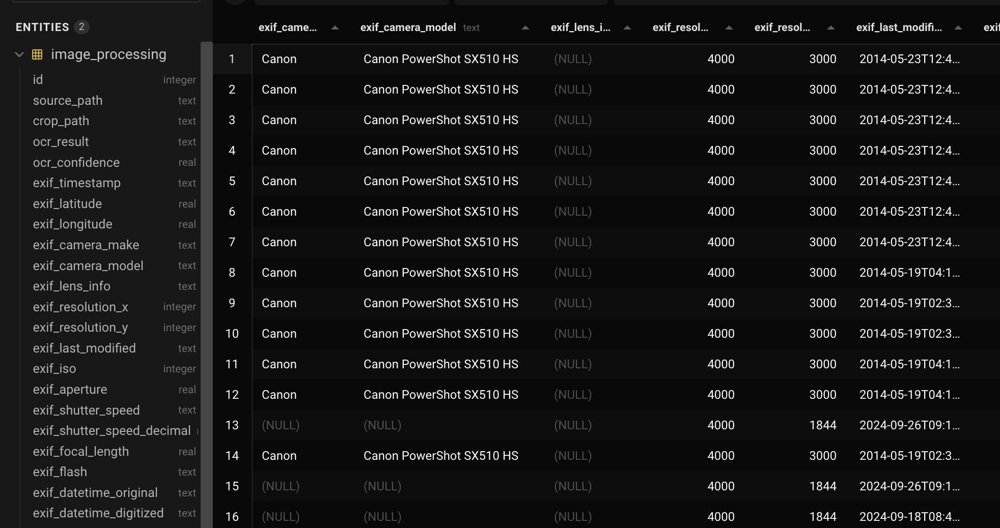
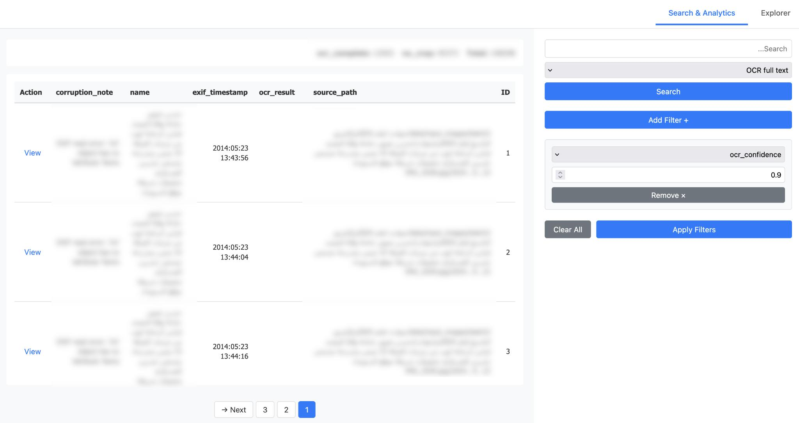

# The Damascus Dossier: Getting information from 100,000 photos without looking at them

> How we got information from 100,000 photos without looking at them.

<!-- more -->

*Disclaimer: This post mentions investigations into torture, killings, and war crimes. No graphic material is included, but the theme may be unsettling.*

When we were asked to help with a project last year, we faced a unique challenge: extracting structured information from roughly 100,000 photos, many of them duplicates, without looking at every single one. This post breaks down how we built technology to process gigabytes of images while doing our best to protect both the data itself and the people working with the material.

We’re talking about the *Damascus Dossier*. In early December, Norddeutscher Rundfunk (NDR) and the International Consortium of Investigative Journalists (ICIJ) published the investigation, exposing the torture and killing of prisoners under Syria's former president Bashar Al-Assad. 

The collaboration produced heartbreaking stories, including that of [a man who searched for his brother for more than a decade only to discover he had been killed by the regime](https://www.icij.org/investigations/damascus-dossier/syria-assad-regime-detained-dead-search-families/), and of a [hospital that became a crucial part of the killing machine](https://www.tagesschau.de/investigativ/ndr-wdr/syrien-assad-verbrechen-damascus-dossier-104.html).

The project was built on a vast stash of leaked photographs documenting torture and killings, taken by the regime mostly between 2015 and 2024 and meticulously catalogued in complex folder structures. Many images included Arabic text annotations, white rectangles digitally added with details such as victims’ internal IDs, the responsible police or military unit, and sometimes locations, applied as part of the regime’s cataloguing process. 

We decided not to use any of the material to illustrate this post. Examples of the images can be found in [this article by the ICIJ](https://www.icij.org/investigations/damascus-dossier/syria-assad-mass-murder-photos-evidence/) \- please handle with care.

## A Three-Stage Processing System

We came up with a three-stage processing pipeline. In the first stage, we extracted EXIF metadata from the photos and analyzed the folder structures they came from. The second stage used computer vision to detect and isolate the evidence labels within the images, and the third stage applied text recognition (or OCR) to read the information from those labels.

The entire workflow was managed by an orchestrator script, which sole purpose is to call other scripts and track progress using a SQLite database as a simple queuing system. Each image received its own database record that followed it step by step through metadata extraction, label cropping, text recognition, and finally human verification. This setup allowed the pipeline to resume from any interruption point without losing information. It also made it possible to rerun individual steps, for example when fine-tuning the OCR, without having to process everything again. While this may now sound like a straightforward process from start to finish, in reality it involved a lot of trial and error. 

The database stored the extracted Arabic text and OCR confidence scores, EXIF metadata such as timestamps and camera make and model, and a breakdown of the file system hierarchy. It also tracked processing information such as corruption detection, processing timestamps, and the current pipeline status.

## Stage 1: Metadata Extraction

Like all digital photographs, these images contain embedded technical information that can provide important context. This includes metadata from the device or software that created the file, as well as clues hidden in how the files were organized on disk. Our script systematically extracted both the original file paths and any embedded EXIF data.

### Understanding EXIF Data

The EXIF data in this project was not especially rich, but it’s still worth explaining what it is. EXIF stands for [Exchangeable Image File Format](https://en.wikipedia.org/wiki/Exif) and is a standardized tagging system used for images and videos. Most modern cameras, including smartphones, automatically populate these tags and attach them to the image file. EXIF data can reveal when and how a picture was taken and sometimes whether it was edited or manipulated.

Using [PIL](https://en.wikipedia.org/wiki/Python_Imaging_Library), we captured as much of this information as possible: multiple timestamps, technical details such as camera make and model, lens information like focal length and aperture, ISO and exposure settings, and serial numbers for both camera bodies and lenses. In practice, many of these fields were empty across the dataset. Still, in theory, this kind of technical fingerprinting can link specific equipment to particular time periods or groups of images.



### Parsing Folder Hierarchies

The folder hierarchies and naming conventions turned out to be just as important. These paths helped provide context for individual images and also allowed us to sanity-check some of the EXIF data, especially timestamps. With older digital cameras, timestamps are only correct if someone manually sets the date and time, usually after changing batteries.

The main challenge here was that the original file paths mixed Arabic and Latin letters ([Bidirectional text](https://en.wikipedia.org/wiki/Bidirectional_text), anyone?) and numbers and did not follow a consistent date format, even though they were usually understandable to a human reader. Somewhat like this: 

```
folder/15.03.2018\_عسكرية/another\_folder

folder/12-04-19 شرطة/another\_folder

folder/2021\_شرطة 12-04/another\_folder 
```

The extraction loop walks the entire folder structure, scanning all directory levels for anything that looks like a date and attempting to parse it. When only partial dates are found, such as a day and month, we combine them with year information extracted from parent directories. All temporal data is normalized into [a consistent format](https://xkcd.com/1179/), while organizational identifiers, such as the Arabic text in the examples above, are stored separately. This approach wasn’t perfect, but after some regex tuning, the results were good enough to be useful.

With this context in place, we could move on to the most computationally intensive part of the process: isolating the evidence labels and reading the text they contained.

## Stage 2: Label Detection

As described earlier, most of the images contained manually added digital labels: white rectangles with dark text overlaid directly onto the photographs using image editing software. These labels were not stored as separate files or metadata. They were permanently burned into the image pixels, which meant detecting them was a computer vision problem rather than a simple metadata task. Running OCR across entire images would have been slow and error-prone, so instead we focused on detecting and cropping just the labels themselves.

### The Flood Fill Algorithm

Let's talk about flood fill algorithms. Imagine the paint bucket tool in image editing software. You click on a pixel, and it “floods” all connected pixels of the same color. Our algorithm works similarly, but with three pixel categories: white pixels ([RGB brightness](https://en.wikipedia.org/wiki/RGB_color_model) between 245-255) representing label backgrounds, black pixels (brightness below 10\) representing text, and everything else representing the actual photograph content.

The process works as follows. We start with a pixel, and if it is white, we flood all adjacent white pixels and keep expanding. When the flood encounters something that is not white, one of three things has happened. We may have hit text inside a label, which we ignore. We may have hit the outer edge of a white rectangle, which is exactly what we are looking for. Or the white pixels may not belong to a label at all, which usually becomes obvious because there is no straight, consistent boundary around them.

By repeating this process across the image and keeping track of pixels already examined, the algorithm will eventually find a white rectangle if one is present. We had to tune this carefully. Early on, labels with a lot of text produced false negatives, so we added additional checks to ensure that a detected box exceeded a minimum size and consisted of at least 60 percent white background.

### Performance Optimizations

Our first implementation was extremely slow and placed a significant load on the system. The key improvement was a multi-resolution approach. We first downsampled images and searched for rectangles at low resolution, which was much faster. Once a label’s location was found, we cropped the full-resolution image.

We also stopped checking every single pixel. Instead, we used adaptive step sizes, jumping ahead by increments calculated as 1 percent of the image dimensions.

## Stage 3: Arabic Text Recognition for Evidence Extraction

Once the white rectangles were isolated, we could move to the final step: extracting the Arabic text from the evidence labels. These labels contained victim identification numbers and other critical information. Finding the right solution for this stage was challenging because of strict project constraints. None of the data was allowed to leave the machine, which ruled out sending images to a random data center in California and praying to the AI gods that the results were good. We initially tested Tesseract, a well-established OCR engine, but the Arabic results were not reliable enough for our needs, especially when the text was underlined.

### Choosing Apple's Vision Framework

We took a different approach and moved the OCR step onto a Mac Mini so we could use [Apple’s Vision framework](https://developer.apple.com/documentation/vision). This is the same technology that powers text recognition in iPhone photos and allows users to search their photo libraries by typing words like “computer” to find both images of computers and images containing the word. On macOS, Apple exposes this functionality through local APIs, which meant everything could run entirely on-device and meet our security requirements.

We were not interested in object recognition but in character recognition, which Apple provides through VNRecognizeTextRequest (Documented [here](https://developer.apple.com/documentation/vision/vnrecognizetextrequest)). The downside was that this required writing a new script in Swift, Apple’s preferred programming language, which was new to us. Still, the tradeoff was worth it to keep all processing local.

### Disabling Language Correction

After some experimentation, we had a working Swift script, but the results were initially poor. The key improvement came from disabling a feature that is usually very helpful: language correction. By default, VNRecognizeTextRequest assumes that the text it is reading forms real words and biases its output toward combinations that exist in a language’s vocabulary. For example, if a label says “apple” but the image quality makes it unclear whether a character is a lowercase “l” or the digit “1,” the system will prefer “l” because “p1e” is unlikely in English.

This behavior makes sense for natural language text, but it is exactly what you don’t want for prisoner IDs and other identifiers that consist of arbitrary sequences of letters and numbers. Disabling language correction, along with allowlisting the Arabic alphabet and a small set of characters we knew were present, dramatically improved the accuracy of the extracted text.

The outcome was a searchable database measuring only a few megabytes. It contained EXIF data, extracted metadata, recognized text with confidence scores where available, and links to the cropped evidence labels saved as separate image files.

## Making Data Useful for Humans

Realistically, no non-technical journalist would ever want to open that file. To make the information accessible, we built a Flask-based web interface that lets investigators work with the pipeline’s results without having to look at large numbers of traumatic images.

Because the Arabic text had already been extracted and the relevant image regions isolated, investigators only see the full original photographs when they actually need to (and decide to click the button). By default, the interface shows cropped evidence labels. For images where no label was detected, we apply a blur that leaves the image just recognizable enough to confirm that no white rectangle is present, without exposing detail.

The application has two main modes. The Explorer is designed for systematic review of individual records, showing one item at a time with the cropped label, the extracted Arabic text in an editable text area, and additional metadata in a collapsible panel. Investigators can correct OCR errors directly in the interface, with edits saved back to the database. We also added an on-screen keyboard to make entering Arabic characters easier. Even with Apple’s strong OCR performance, human review remains essential.

The Analytics section supports broader investigative work, offering full-text search across OCR results, line-specific searches, and source path queries. Filters allow investigators to narrow results by processing status, camera model, date ranges, and even specific folder levels, enabling questions like “show me all files where the third subfolder contained the word X.” 



All of this was deployed using Docker Swarm on our own infrastructure, secured with Keycloak for access management and a segmented S3-compatible storage system for the raw images, served as signed URLs. Throughout the whole process, no data was sent to an external API or stored on a computer we don’t fully control.

## Conclusion

What began as a technical challenge ultimately became a reminder of why technology matters in journalism and human rights work. The pipeline we built turned what would have been months of traumatic manual labor into a searchable, analyzable database that allowed investigators to trace patterns, identify victims, and build cases for accountability. In other words, it allowed them to start their actual work.
