<section class="screen screen--bg-black" data-background-color="black" markdown>

# Some work we're proud of

We are involved in many investigative journalism projects and maintain several [follow the money](https://followthemoney.tech) databases. Here is an incomplete list of some of our work we're proud of.

We sometimes publish more in-depth **case studies** of our collaborations with partners [in our blog](./blog/index.md).

-   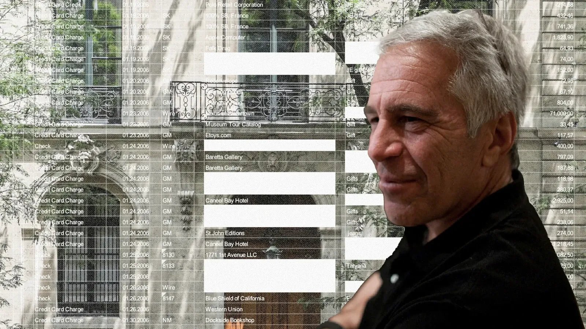{.no-shadow}

    <kbd>aleph</kbd> <kbd>leaks</kbd>

    ## The Epstein Emails

    *DER SPIEGEL / ZDF Frontal / Paper Trail Media – 2025-12-20*

    ### What is it about?

    The [SPIEGEL](https://www.spiegel.de) / [ZDF Frontal](https://www.zdf.de/frontal-108) / [Paper Trail Media](https://www.papertrailmedia.de/) investigation, based on leaked emails from [Jeffrey Epstein's](https://de.wikipedia.org/wiki/Jeffrey_Epstein) personal inbox, reveals how Epstein targeted women from Germany, Austria, and Switzerland for his trafficking network. Two sisters from Hamburg, who were approached by Epstein's associate in 2006 under the guise of a modeling opportunity, shared their story with ZDF. At ages 16 and 18, they were invited to Epstein’s New York townhouse, where he promised to help them build a modeling career. The leaked emails, spanning from 2002 to 2019, provide evidence of Epstein’s methods to lure women into his exploitative circle, highlighting his global connections and the reach of his manipulative tactics. 

    [SPIEGEL story in german, paywall](https://www.spiegel.de/ausland/jeffrey-epstein-wie-zwei-deutsche-schwestern-seiner-missbrauchsfalle-entkamen-a-1e0e6aa0-5725-4485-ade0-2c41267ce48f)

    [ZDF story, german](https://www.zdfheute.de/politik/ausland/epstein-frauen-deutschland-100.html)

    ### What we did

    We made the leak, provided by the [Distributed Denail of Secrets](https://ddosecrets.com), searchable with our open source investigative search platform [OpenAleph](https://openaleph.org) in collaboration with SPIEGEL / ZDF / Paper Trail.

    [View project](https://www.zdfheute.de/politik/ausland/epstein-frauen-deutschland-100.html){.btn}
{ .card--full }

-   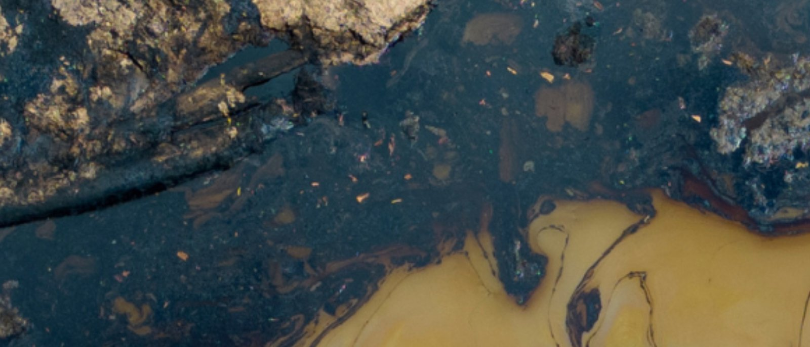{.no-shadow}

    <kbd>aleph</kbd> <kbd>data engineering</kbd> <kbd>leaks</kbd>

    ## The Iguana Papers

    *Environmental Investigation Agency – 2025-03-19*

    ### What is it about?

    [Crude Lies](https://eia.org/report/crude-lies/)is the result of more than two years of investigation by the [Environmental Investigation Agency (EIA)](https://eia.org) into Ecopetrol, Colombia's state-owned oil company. The findings and the internal database behind them, referred to as the Iguana Papers, offer a rare glimpse into “business as usual” at the country’s largest corporation.

    EIA’s investigation was triggered by an email received in September 2021 from Andrés Olarte Peña, linking to a series of folders and files. The Iguana Papers were developed from this material. Most of the files were created or updated between January 2017 and January 2019, during Olarte’s time at Ecopetrol’s corporate headquarters in Bogotá. His decision to blow the whistle on the most powerful company in his home country opened the door for a “too big to fail” company to be caught failing.

    [Read the report by Environmental Investigation Agency](https://eia.org/report/crude-lies/)

    [Read the BBC investigation](https://www.bbc.co.uk/news/articles/crewlj11jljo)

    ### What we did

    We provided a temporary, standalone public [OpenAleph](https://openaleph.org) instance for EIA, optimized for high load during the publication phase. This included additional security and caching layers, as well as a failover replica in another data center.

    [View project](https://aleph.eia.org/){.btn}
{ .card--full }

-   {.no-shadow}

    <kbd>aleph</kbd> <kbd>leaks</kbd> <kbd>data engineering</kbd>

    ## Library of Leaks

    *Distributed Denial of Secrets – 2024-12-03*

    The Library of Leaks is a project of [Distributed Denial of Secrets (DDoSecrets)](https://ddosecrets.org), a non-profit that specializes in publishing, archiving and analyzing leaked and hacked datasets. The Library of Leaks is the world's largest public collection of previously secret information.

    [View project](https://libraryofleaks.org){.btn}
{ .card--full }

-   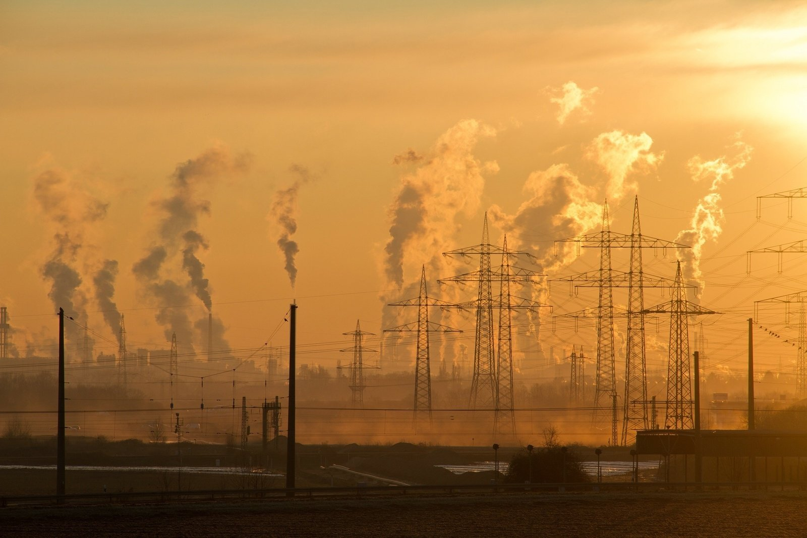{.no-shadow}

    <kbd>database</kbd> <kbd>followthemoney</kbd> <kbd>data engineering</kbd> <kbd>cross matching</kbd>

    ## How much does the fossil fuel industry fund medical research?

    *The British Journal of Medicine – 2024-11-28*

    ### What is it about?

    An investigation by The BMJ reveals the extent of the fossil fuel industry’s involvement in medical research, prompting renewed calls for academics and publishers to cut ties with such companies.

    Over the past six years, more than 180 medical articles or medical-related pieces in other publications have acknowledged funding from the fossil fuel industry. An additional 1,000 articles were authored by individuals employed by fossil fuel companies or affiliated organizations, The BMJ's analysis found.

    ### How we contributed

    This research is part of our project [FollowTheGrant](https://followthegrant.org), where we maintain a database of scientific publications, their authors and institutions, and potential conflicts of interest. In this analysis, we cross-referenced fossil fuel companies with funding information and acknowledgements in medical articles, and examined the relationships between affiliated research organizations and industry players.

    [View project](https://www.bmj.com/content/387/bmj.q2589){.btn}
{ .card--full }

-   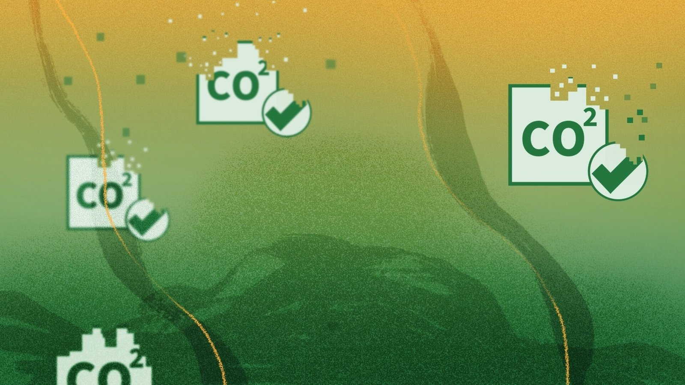{.no-shadow}

    <kbd>followthemoney</kbd> <kbd>data engineering</kbd> <kbd>cross matching</kbd>

    ## Die Ökogas-Lüge

    *CORRECTIV – 2024-04-16*

    ### What is it about?

    A CORRECTIV investigation reveals that gas suppliers across Germany are advertising “climate-neutral natural gas,” but they are not keeping their promises. Supposedly protected forests are being cleared, and gas-fired power plants are even being expanded. This is how companies are misleading hundreds of thousands of customers while fueling the climate crisis.

    ### How we contributed

    We supported the analysis by cross-referencing the [German Marktstammdatenregister](https://www.marktstammdatenregister.de/MaStR/Akteur/Marktakteur/IndexOeffentlich) with the emission compensation projects databases of [VERRA](https://registry.verra.org/) and [Gold Standard](https://registry.goldstandard.org/projects?q=&page=1) using our [FollowTheMoney](https://followthemoney.tech) data engineering stack.

    [View project](https://correctiv.org/aktuelles/klimawandel/2024/04/16/erdgas-die-oekogas-luege/){.btn}
{ .card--full }

-   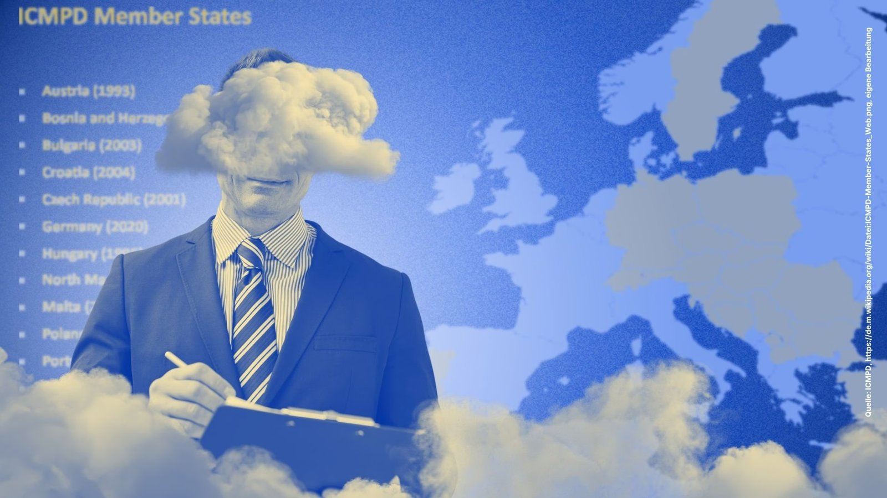{.no-shadow}

    <kbd>leaks</kbd> <kbd>aleph</kbd> <kbd>database</kbd>

    ## Die Migrations-Manager

    *FragDenStaat – 2023-05-19*

    ### What is it about?

    FragDenStaat investigators exposed the International Centre for Migration Policy Development (ICMPD) for its role in shaping Europe’s discriminatory, racist, and human rights-violating migration policies. Their research revealed that the organization directly and indirectly influences European migration policy and actively supports the tightening of asylum laws. Although largely invisible to the public, ICMPD has helped orchestrate some of the most troubling strategies related to border control, asylum seeker detention and deportation, refugee surveillance within Europe, suppression of journalistic activity, and more.

    ### How we contributed

    We obtained leaked documents and quickly ingested them into a dedicated [OpenAleph](https://openaleph.org) instance, making the documents researchable and accessible to the investigative team.

    [View project](https://fragdenstaat.de/blog/2023/05/19/icmpd-die-migrations-manager/){.btn}
{ .card--full }

-   {.no-shadow}

    <kbd>database</kbd> <kbd>aleph</kbd> <kbd>leaks</kbd>

    ## Effizient und dezent: Wer ist das ICMPD?

    *ZDF Magazin Royale – 2023-05-19*

    ### What is it about?

    This investigative broadcast special focuses on the International Centre for Migration Policy Development (ICMPD), its connections to German politicians, its role in shaping migration policies currently being developed in Germany—particularly in Bavaria—and the impact of these projects both within and beyond Europe. Think of it as the German version of John Oliver’s Last Week Tonight.

    ### How we contributed

    We obtained leaked documents and quickly ingested them into a dedicated [OpenAleph](https://openaleph.org) instance, making the documents searchable and accessible to the investigative team.

    [View project](https://www.youtube.com/watch?v=QuKbsIPNi7Q){.btn}
{ .card--full }

-   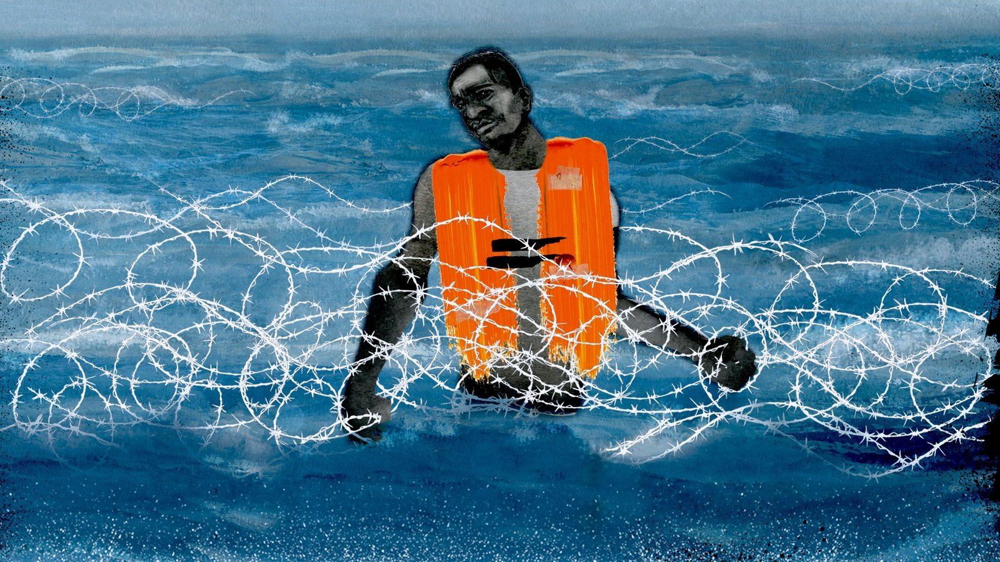{.no-shadow}

    <kbd>database</kbd> <kbd>aleph</kbd> <kbd>leaks</kbd>

    ## How an EU-funded agency is working to keep migrants from reaching Europe

    *Coda – 2023-05-31*

    ### What is it about?

    This project explores how the European Union carries out border control operations that are known to be extremely violent, dehumanizing, and excessive, often without taking responsibility or accountability. It uncovers tactics such as partnering with the International Centre for Migration Policy Development (ICMPD), an organization known for its involvement in these cruel and opaque practices, along with other third-party groups.

    ### How we contributed

    We obtained leaked documents and quickly ingested them into a dedicated [OpenAleph](https://openaleph.org) instance, making the documents searchable and accessible to the investigative team.

    [View project](https://www.codastory.com/authoritarian-tech/icmpd-eu-refugee-policy/){.btn}
{ .card--full }

-   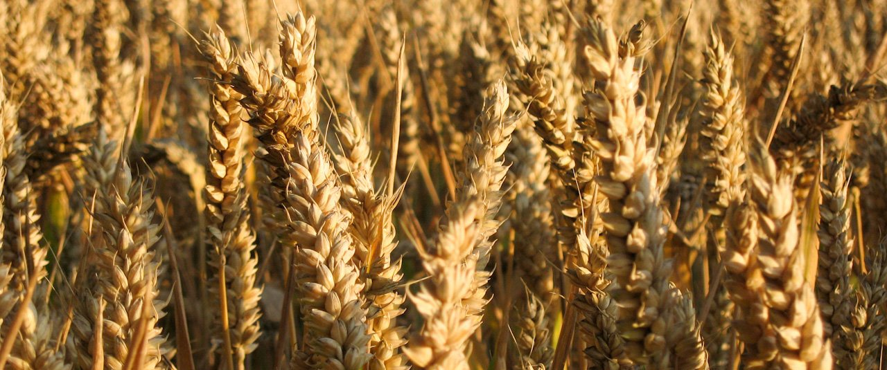{.no-shadow}

    <kbd>followthemoney</kbd> <kbd>database</kbd> <kbd>data engineering</kbd> <kbd>cross-border</kbd>

    ## Who receives EU farm subsidies?

    *FragDenStaat – 2022-12-01*

    ### What is it about?

    This project aims to obtain and share detailed data on the payments and recipients of farm subsidies in every EU member state so European citizens can be confident their tax money goes to the right hands. But it’s more than just subsidies — they also influence food prices, environmental policies, rural economies, biodiversity, climate change mitigation in Europe, and more. The system is therefore inequitable and complex, making it difficult for farmers to navigate.

    In cooperation with WDR, NDR, Süddeutsche Zeitung, Correctiv, Der Standard, IrpiMedia, Reporter.lu, Reporters United, Expresso, Follow The Money, and Gazeta Wyborcza, FragDenStaat analyzed the data and published stories jointly. Farmsubsidy.org is run by FragDenStaat, the central contact for all questions relating to freedom of information in Germany.

    ### How we contributed

    We provided comprehensive data engineering services, including scraping national data sources, cleaning the data, and making it comparable and analyzable. We built the API and website for the exploration tool you see today. Additionally, we transformed the data into the [FollowTheMoney](https://followthemoney.tech) standard to make it searchable in [OpenAleph](https://openaleph.org).

    [View project](https://farmsubsidy.org){.btn}
{ .card--full }

-   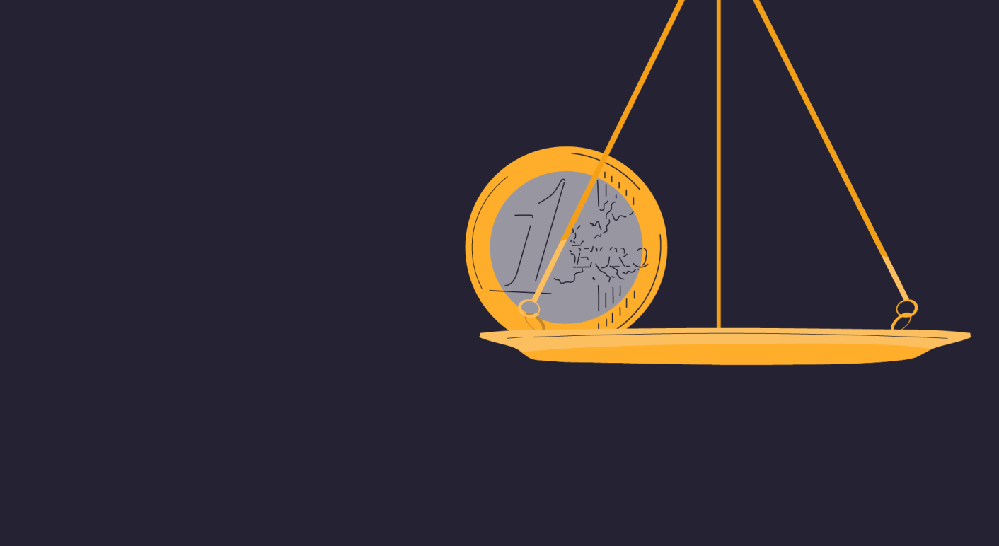{.no-shadow}

    <kbd>database</kbd> <kbd>followthemoney</kbd>

    ## Who receives court donations in Germany?

    *CORRECTIV – 2023-02-15*

    ### What is it about?

    Every year, judges and public prosecutors distribute millions of euros from discontinued criminal proceedings. They have full discretion over which associations receive the funds. However, the lack of transparency has been criticized for years. Now, around 50,000 funded organizations can be searched in an updated CORRECTIV database.

    ### How we contributed

    We provided an extensive data engineering solution to clean the data effectively, transform it to the [FollowTheMoney](https://followthemoney.tech) standard, and de-duplicate entities within the dataset, making it accessible and searchable for the team. We also built the API and website to give the public access to the exploration tool.

    [View project](https://spendengerichte.correctiv.org){.btn}
{ .card--full }

-   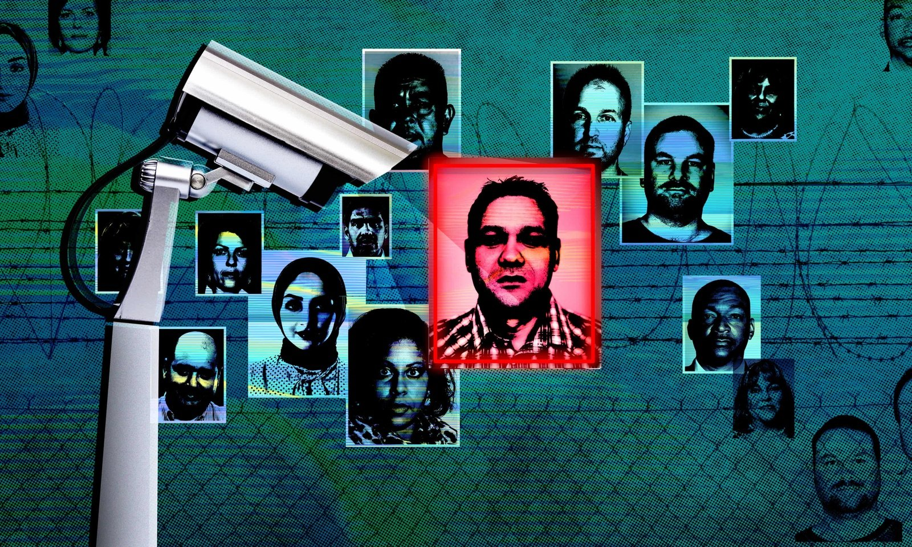{.no-shadow}

    <kbd>database</kbd> <kbd>followthemoney</kbd> <kbd>cross matching</kbd>

    ## Who receives EU security and military funding?

    *opensecuritydata.eu*

    ### What is it about?

    Open Security Data Europe is a public platform that tracks and displays how the European Union spends money on security-related projects, including policing, border control, counter-terrorism, cybersecurity, weapons, and other military equipment. The platform is a tool for journalists, researchers, civil society organizations, and others to better understand the EU’s growing investments in security.

    ### How we contributed

    We provided an extensive data engineering solution to effectively clean the data for use in [OpenAleph](https://openaleph.org), de-duplicate and cross-reference entities within the dataset, and make it accessible and searchable for team use. We also built the website to give the public access to the exploration tool.

    [View project](https://opensecuritydata.eu/){.btn}
{ .card--full }

-   {.no-shadow}

    <kbd>database</kbd> <kbd>followthemoney</kbd> <kbd>cross matching</kbd> <kbd>data engineering</kbd>

    ## Who gets paid by the pharmaceutical industry?

    *FollowTheGrant – 2020-12-14*

    ### What it is about?

    Over the past three years, the project has evaluated more than 4.9 million medical articles from 27,000 journals worldwide, including work by around 8.5 million authors. The project database is available for further research.

    The project revealed that conflicts of interest are widely under-reported in scientific literature. It identified examples of failure to disclose conflicts of interest and showed which companies are heavily involved in research that has conflicts of interest.

    ### How we contributed

    For this project, we provide everything from scraping a diverse range of data sources to cleaning the data, transforming it into the FollowTheMoney standard and making it comparable. We use different methods to de-duplicate entities within the data and operate a custom [OpenAleph](https://openaleph.org) database which allows the data to be easily accessible and searchable for external partners.

    [View project](https://followthegrant.org){.btn}
{ .card--full }

-   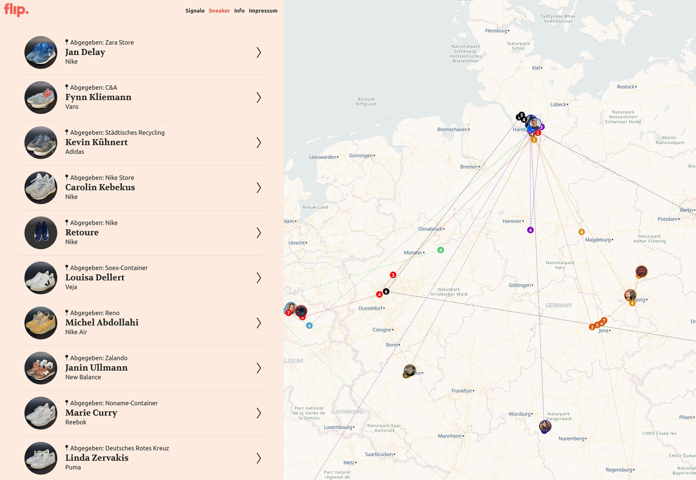{.no-shadow}

    <kbd>data engineering</kbd>

    ## Where do our old sneakers end up?

    *flip. | NDR | DIE ZEIT – 2021-11-02*

    ### What is it about?

    What happens to the millions of shoes discarded every year in Europe? Around 2.5 billion shoes are produced annually, and many eventually end up in the trash. Sneakerjagd’s mission is to shed light on the sneaker industry and fact-check the sustainability promises of manufacturers and recyclers. To do this, they equipped eleven pairs of sneakers from German celebrities with GPS trackers to study the recycling cycle and track the shoes’ whereabouts. The project is still ongoing, so stay tuned!

    ### How we contributed

    We created and developed a custom data pipeline solution that enables the data visualization you see now. This project was unique because we had to wrangle and clean large volumes of raw satellite data.

    [View project](https://sneakerjagd.letsflip.de/){.btn}
{ .card--full }

-   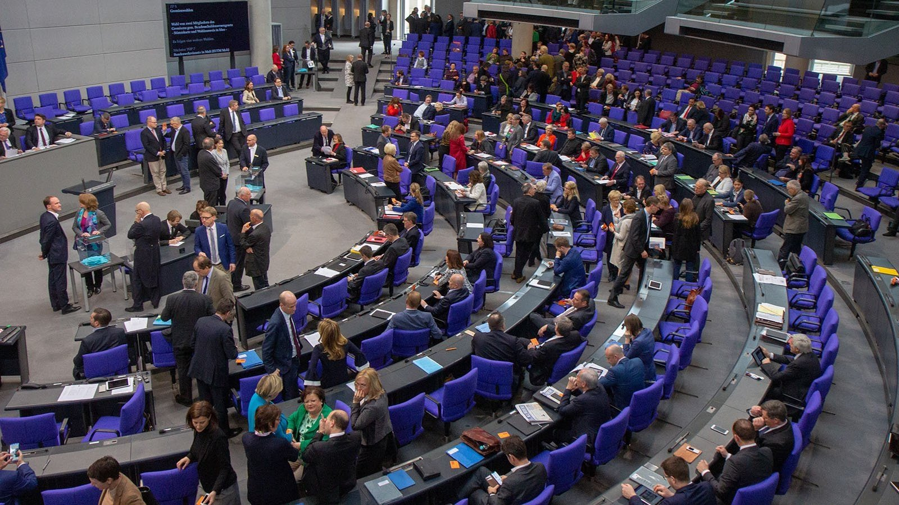{.no-shadow}

    <kbd>data engineering</kbd> <kbd>scraping</kbd> <kbd>document collections</kbd>

    ## Scraper collection of documents from regional parliaments in Germany

    *FragDenStaat*

    ### What is it about?

    Dokukratie is a database designed to give journalists access to public legal papers. From small inquiries to major reports, Dokukratie allows users to access and download various legal documents from the Bundestag. All these publicly available documents are condensed into a single platform.

    ### How we contributed

    We developed and implemented a data engineering solution that scraped a vast resource of federal-level data and extracted the documents. After gathering the documents, we cleaned the data and made it accessible and searchable in [OpenAleph](https://openaleph.org).

    [View project](https://github.com/okfde/dokukratie/){.btn}
{ .card--full }

</section>
