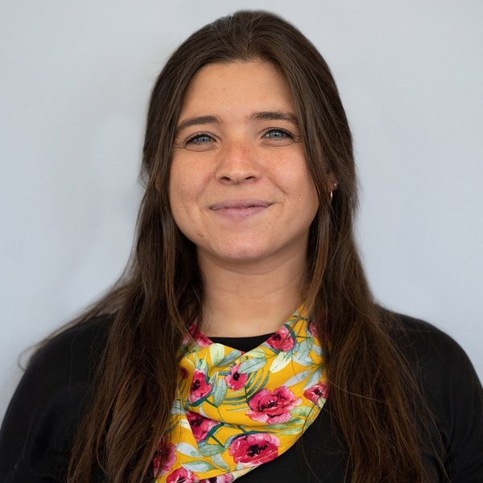
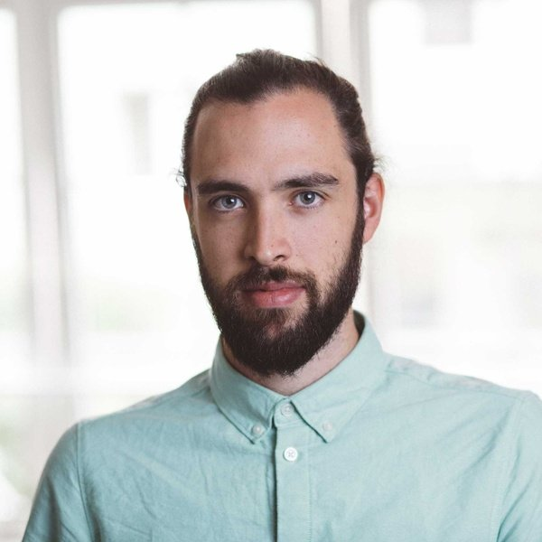
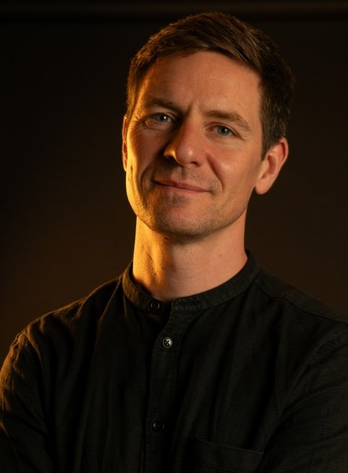
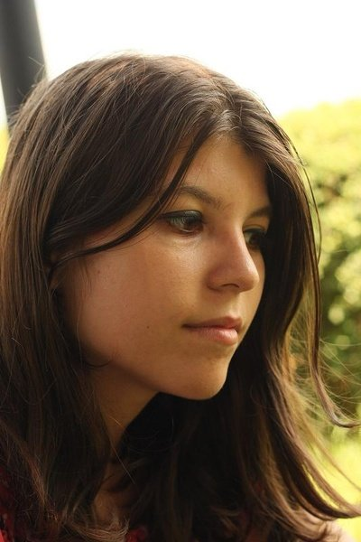
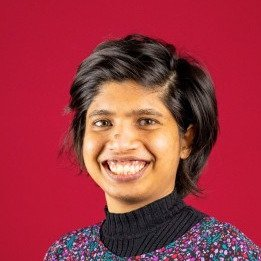
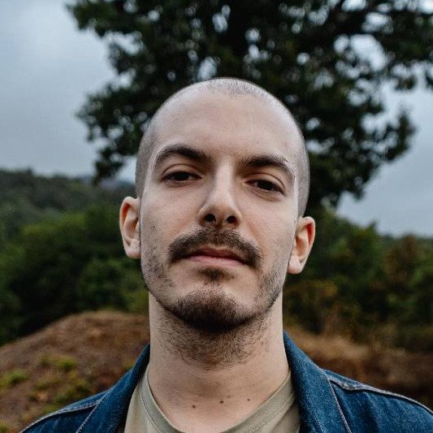

<section class="screen screen--bg-black screen--full-height" data-background-color="black" markdown>

# Who we are

DARC is an independent organization providing bespoke data and research services for investigative teams.

Our team has decades of combined experience in investigative journalism and developing research tools and software. Our founders Karina, Simon and Jan have worked on multiple award-winning, cross-border, cross-newsroom investigations with [Norddeutscher Rundfunk](https://ndr.de), the [Organized Crime and Corruption Reporting Project](https://occrp.org) and [CORRECTIV](https://correctiv.org). 

With our core team and trusted network of collaborators, we can easily scale to meet the demands of any project.

## Our Team

-   

    __Karina Shedrofsky__ `she/her`{.muted}

    *Director of Research*

    **Karina** enables impactful investigations as DARC's Director of Research, driven by a passion for tracking elusive individuals and leveraging open-source data to uncover hidden connections. Before joining DARC, Karina spent eight years at [OCCRP](https://occrp.org), where she co-led the research and data team, helping journalists track people, companies, and assets across the globe. Her research contributed to numerous award-winning investigations and major cross-border projects, including [Dubai Unlocked](https://www.occrp.org/en/project/dubai-unlocked), the [Russian Asset Tracker](https://www.occrp.org/en/project/russian-asset-tracker), [Paradise Papers](https://www.occrp.org/en/project/paradise-papers), [FinCEN Files](https://www.occrp.org/en/project/the-fincen-files) and [OpenLux](https://www.occrp.org/en/project/openlux). Prior to OCCRP, Karina worked at USA Today, covering health and key issues in the 2016 U.S. presidential election. She is a graduate of the Philip Merrill College of Journalism at the University of Maryland.

    [:material-email: Email](mailto:karina@dataresearchcenter.org){.btn}
    [:material-linkedin: LinkedIn](https://www.linkedin.com/in/karinashed/){.btn}
{ .card--full }

-   

    __Simon Wörpel__ `he/him`{.muted}

    *Director of Technology*

    **Simon** leads the investigative tooling development, including [OpenAleph](https://openaleph.org/), as DARC's Director of Technology. In mid-2023, Simon founded DARC's predecessor, the independent tech organization investigativedata.io. Prior to that, he helped various newsrooms and research teams across Europe to find stories in leaked data and built data pipelines for investigative research. From 2015 to 2019 he worked as a data journalist and newsroom developer at the German non-profit investigative newsroom [CORRECTIV](https://correctiv.org). There he built document databases and security infrastructure for award-winning, cross-border and cross-newsroom investigations like [The CumEx Files](https://correctiv.org/en/latest-stories/2018/10/18/the-cumex-files/), [Grand Theft Europe](https://correctiv.org/en/top-stories/2019/05/07/grand-theft-europe/) or [Wem gehört Hamburg](https://correctiv.org/top-stories/2018/11/23/wem-gehoert-hamburg/). Simon attended journalism school, still writes actual texts (rarely) and was recognized by Medium Magazine as one of the "Top 30 until 30" journalists.

    [:material-email: Email](mailto:simon@dataresearchcenter.org){.btn}
    [:material-web: Website](https://wrpl.de){.btn}
    [:material-linkedin: LinkedIn](https://www.linkedin.com/in/simonwoerpel/){.btn}
{ .card--full }

-   

    __Jan Strozyk__ `he/him`{.muted}

    *Director of Data and Journalism Projects*

    **Jan**'s interest lies in the convergence of technology and investigative journalism, where he contributes to shaping the future of reporting as DARC's Director of Data and Journalism Projects. Before launching DARC, Jan served as the Chief Data Editor at [OCCRP](https://occrp.org), where he co-led the research and data team. Jan's journalism career took off as reporter in the investigative department of Germany's public broadcaster [Norddeutscher Rundfunk](https://www.ndr.de/), contributing to groundbreaking exposés like the [Luxembourg Leaks](https://www.icij.org/investigations/luxembourg-leaks/), [Panama Papers](https://www.tagesschau.de/thema/panama_papers), [Russian Asset Tracker](https://www.occrp.org/en/project/russian-asset-tracker), and [FinCEN Files](https://www.icij.org/investigations/fincen-files/). His outstanding work earned him the European Press Prize, the German Television Award (Deutscher Fernsehpreis), and he was recognized by Medium Magazine as one of the "Top 30 until 30" journalists.

    [:material-email: Email](mailto:jan@dataresearchcenter.org){.btn}
    [:material-linkedin: LinkedIn](https://www.linkedin.com/in/jlstro/){.btn}
{ .card--full }

-   

    __Alexandra Ștefănescu__ `she/them`{.muted}

    *Senior Developer*

    **Alex** is an [open-source developer](https://github.com/catileptic/) working on investigative tooling, including [OpenAleph](https://openaleph.org). She is the CTO of the digital rights advocacy non-profit [Asociația pentru Tehnologie și Internet](https://apti.ro/) and has served as the CTO of the civic rights non-profit [Code for Romania](https://www.code4.ro/ro) in the past. Before joining DARC, she was part of the Aleph development team at OCCRP. She believes in putting technology in the service of society. She writes [essays](https://catileptic.tech/) (and [articles](https://catileptic.tech/projects/)) as much as she writes code. In order to keep up with her colleagues' mentions of the number 30, she would like to note she's on the Romanian Forbes "[30 under 30](https://www.forbes.ro/articles/30-sub-30-alexandra-stefanescu-vreau-sa-le-arat-oamenilor-interesati-tot-ce-invatat-pe-parcurs-137631)" list.

    [:material-email: Email](mailto:alex@dataresearchcenter.org){.btn}
    [:material-web: Website](https://catileptic.tech){.btn}
    [:material-linkedin: LinkedIn](https://www.linkedin.com/in/sabina-alexandra-stefanescu-ba071469/){.btn}
{ .card--full }

-   

    __Shenya De Silva__ `she/her`{.muted}

    *Investigative Data Engineer*

    **Shenya** works for DARC as an investigative data engineer, focused on making complex datasets accessible and uncovering insights from them. This means the [DARC Data Library](https://dataresearchcenter.org/library) is about to get a lot bigger and better. After working in wildlife conservation and welfare, as well as in product development and consulting, she transitioned into building data-driven systems. Before joining DARC, at the Museum für Naturkunde, she contributed to a project extracting extirpated species data from research papers, bridging ecological knowledge with modern data techniques.

    [:material-email: Email](mailto:shenya@dataresearchcenter.org){.btn}
    [:material-linkedin: LinkedIn](https://www.linkedin.com/in/shenya/){.btn}
{ .card--full }

-   

    __Gabriele Di Donfrancesco__ `he/him`{.muted}

    *Business Development and Investigations Fellow*

    **Gabriele** joins DARC through the Erasmus for Young Entrepreneurs initiative. He is a freelance investigative journalist who combines OSINT, collaborative journalism, and traditional reporting techniques to shed light on environmental and white-collar crime, supply chains, and building speculation. He contributes to local and national news outlets in Italy, including RomaToday, IRPI, Domani, and RAI Radio, after years of writing for La Repubblica. His work has also been published in the US, UK, Germany, Spain, Poland, and France. He has never won a prize (yet!), but he does know how to make a good espresso.

    [:material-email: Email](mailto:gabriele@dataresearchcenter.org){.btn}
    [:material-linkedin: LinkedIn](https://www.linkedin.com/in/gabriele-di-donfrancesco-645036319/){.btn}
{ .card--full }

## Our Advisors

**Emma Prest** is a strategist in public interest journalism who led OCCRP’s data, tech, and research teams and previously served as Executive Director of DataKind UK.

**Khadija Sharife** is an investigative writer and former OCCRP senior investigator known for her work on global corruption, illicit finance, and environmental injustice.

**Simon Willnauer** is the Co-Founder of Elastic and former Tech Lead for Elasticsearch, with deep expertise in distributed systems, search functionality, and open source infrastructure.

**Friedrich Lindenberg** is the founder of OpenSanctions and creator of Aleph, with a long track record of building open source tools for investigative journalism at OCCRP and beyond.

**Jonathan Soma** is a data journalist, educator, and programmer who teaches at Columbia University’s Journalism School and has collaborated with ProPublica, The New York Times, and WNYC.

## Become part of it

We're always looking to build new connections. Whether you're interested in collaborating or joining our network, email us at [hi@investigativedata.org](mailto://hi@investigativedata.org)

</section>
